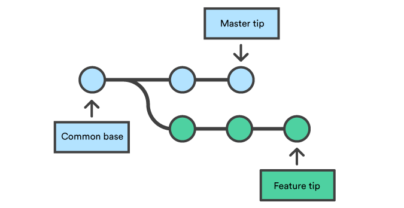

## Creating a branch

### Branches
In simplest terms, branching allows you to seperate from the main line (with entire history of project at that point) so that your further development doesn't disturb other works. Branching is a crucial part in several VCS. A major advantage of Git is that branching operations are lightweight thereby making them superfast. 

The default branch in a Git repository is ```master```



### Listing the branches in a project
To get the list of all the branches in your repository.
```git branch```

### Creating a new branch
Now that we have created a repository, let's create a new branch. On your terminal, 

```git branch <branchName>```

This creates a new branch, but you are still in master branch (In Git terminology your HEAD is still pointing to master branch).

To shift/move the HEAD to the new branch we just created,

```git checkout <branchName>```

Alternatively, you can combine both the commands as follows

``` git checkout -b <branchName>```

This creates the branch and checkouts(points the HEAD) to it immediately.

- Previous - [Creating a Repository](./Creating-a-Repository.md) | Next - [Changes and Commiting](./Changes-and-Commiting.md)


-[Back to Main Page](./index.md)