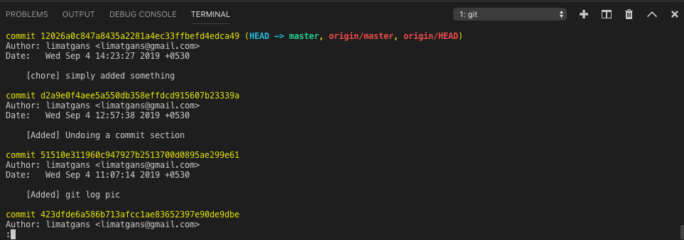
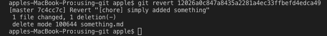
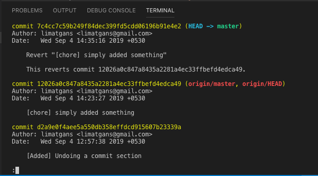

## Undoing a commit.
We can undo a commit in following ways. `git revert` or `git checkout <commitId>` or `git reset`

### Reverting a commit
Sometimes you want to go back to some old commit and discard intermediate commits. Open the log and copy the commit id to which you want to revert to.

Run `git revert <commit_Id_To_Be_Reverted>`

> Note: Instead of removing the commit from the project history, `git revert` figures out how to invert the changes introduced by the commit and appends a new commit with the resulting inverse content. This prevents Git from losing history, which is important for the integrity of your revision history and for reliable collaboration. Always prefer `revert` whenever possible.

Assume following `git log`.

Now we want to revert the commit id `<12026a0c847a8435a2281a4ec33ffbefd4edca49>`.

Just like commit message, git asks us for revert message in the editor. Type :wq in case of Vim editor and press enter.

Now if we log, we can see a new revert commit and the old commit intact in history.

### Checkout to a commit
Previously we have seen that we can use `git checkout <branchName>` to move to a branch. We can also use the same checkout command to move back to an old commit.

`git checkout <commitId>`

> Note: Checking out a specific commit will put the repository in a **"detached HEAD"** state. This means you are no longer working on any branch.

From the detached HEAD state, we can execute `git checkout -b <newBranch>` and start working on the new branch

Essentially What we have done here is we have created `<newBranch>` using the copy of the old branch till the specified `<commitId>`

### Reset
`git reset --hard <commit_Id_To_Be_Removed>` is probably the cleanest way to have an undo. It resets the branch before the `<commit_Id_To_Be_Removed>` and removes the commit from Git History.

> Doing a reset is great for local changes however it adds complications when working with a shared remote repository.

### Revert vs Reset

In general, the preffered way of undoing a commit is using `git revert`. A revert is safer than a reset because it will not remove any commits from a shared history. A revert will retain the commits you want to undo and create a new commit that inverts the undesired commit. 

In short,
- `git revert` is the best tool for undoing shared public changes
- `git reset` is best used for undoing local private changes

- Next - [Forking a Repository](./Forking-a-Repository.md)
- Previous - [Viewing histories](./Viewing-histories.md)  

- [Back to Main Page](./index.md)