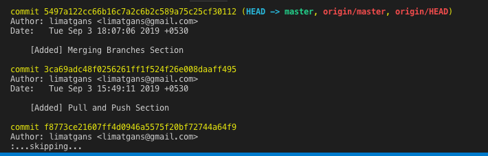

## Viewing histories
To view the history of commits, run `git log`. Press q to exit the log

> Note: Each commit has a unique SHA-1 identifying hash. These IDs are used to travel through the committed timeline and revisit commits.

- Previous - [Deleting a Branch](./Deleting-a-branch.md)   Next - [Undoing a commit](./Undoing-a-commit.md)
- [Back to Main Page](./index.md)
